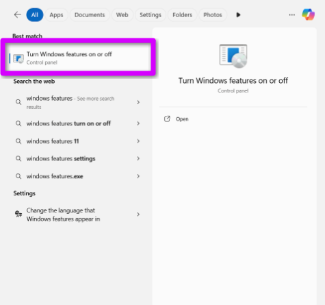
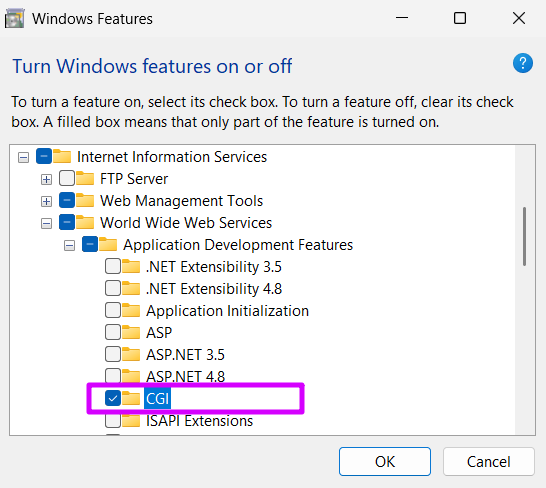
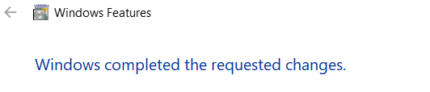
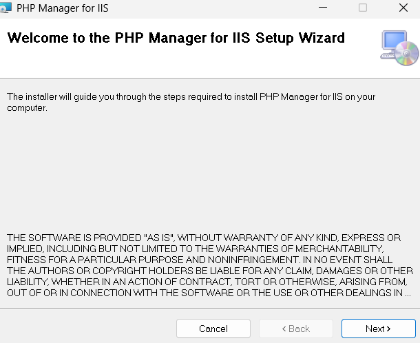
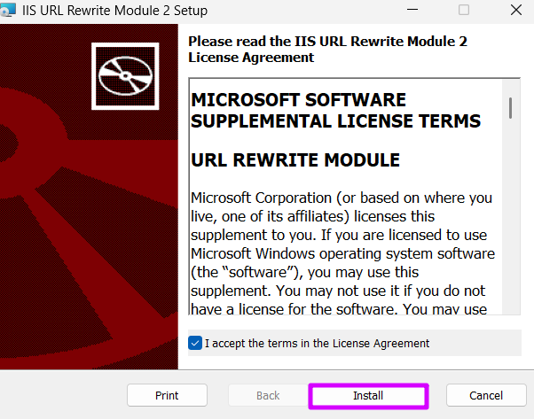
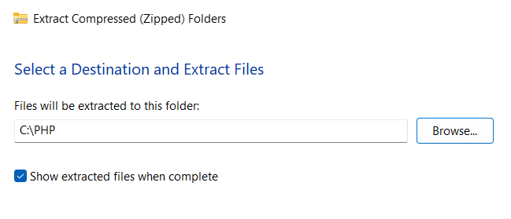
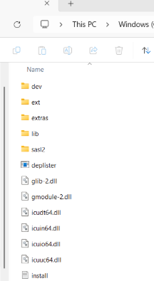

# osTicket-Homelab

<h2>Description</h2>
Fill in
 

<h2>Utilities Used</h2>

<b>osTicket</b>

<b>Oracle VirtualBox</b>

<b>Tailscale</b>

<b>Rustdesk</b>

<h2>Operating Systems Used </h2>

<b>Windows 11</b> 

<h2>Setup:</h2>

Used Rustdesk with Tailscale to securely remote into my home server (Using a headless hdmi):  

 
 

Now that I connected to my homeserver I will need to make a VM using Oracle VirtualBox.   

 
 

The VM started up so I now need to install the following files:
 
  - [osTicket](https://osticket.com/download/) - The help-desk application files.
  - [Visual Studio C++ Redistributable](https://learn.microsoft.com/en-us/cpp/windows/latest-supported-vc-redist?view=msvc-170#latest-supported-redistributable-version) - Libraries required for PHP and MySQL to run on Windows.
  - [MySQL](https://www.mysql.com/downloads/) - The database server.
  - [HeidiSQL](https://www.heidisql.com/download.php) - A lightweight GUI tool to connect to MySQL.
  - [PHP](https://www.php.net/releases/index.php) - The backend logic.
  - [PHP Manager for IIS](https://www.iis.net/downloads/community/2018/05/php-manager-150-for-iis-10) - A simple IIS plugin.
  - [IIS URL Rewrite](https://www.iis.net/downloads/microsoft/url-rewrite) - Translates URLs into the actual PHP scripts.
  

  

Now I need to go into Windows Features and turn on some options (CGI) so that IIS does not just appear as errors and code.  
 
 
 
 
 

Now to install PHP Manager for IIS. This lets us register PHP, switch versions, and enable extensions without having to go directly into the config files.  

IIS URL Rewrite Module allows it to input URLs in osTicket by routing requests to the correct PHP scripts.

 
 

Its time to place the PHP files in the PHP folder. 

 The files should look like this:
 
 
 

X  

 
 
