# osTicket-Homelab

<h2>Description</h2>
Fill in
 

<h2>Utilities Used</h2>

<b>osTicket</b>

<b>Oracle VirtualBox</b>

<b>Tailscale</b>

<b>Rustdesk</b>

<h2>Operating Systems Used </h2>

<b>Windows 11</b> 

<h2>Setup:</h2>

Used Rustdesk with Tailscale to securely remote into my home server (Using a headless hdmi):  

 
 

Now that I connected to my homeserver I will need to make a VM using Oracle VirtualBox.   

 
 

The VM started up so I now need to install the following files:
 
  - [osTicket](https://osticket.com/download/) - The help-desk application files.
  - [Visual Studio C++ Redistributable](https://learn.microsoft.com/en-us/cpp/windows/latest-supported-vc-redist?view=msvc-170#latest-supported-redistributable-version) - Libraries required for PHP and MySQL to run on Windows.
  - [MySQL](https://www.mysql.com/downloads/) - The database server.
  - [HeidiSQL](https://www.heidisql.com/download.php) - A lightweight GUI tool to connect to MySQL.
  - [PHP](https://www.php.net/releases/index.php) - The backend logic.
  - [PHP Manager for IIS](https://www.iis.net/downloads/community/2018/05/php-manager-150-for-iis-10) - A simple IIS plugin.
  - [IIS URL Rewrite](https://www.iis.net/downloads/microsoft/url-rewrite) - Translates URLs into the actual PHP scripts.
  

  

Now I need to go into Windows Features and turn on some options (CGI) so that IIS does not just appear as errors and code.  

 
 

Now to install PHP Manager for IIS. This lets us register PHP, switch versions, and enable extensions without having to go directly into the config files.  

 
IIS URL Rewrite Module allows it to input URLs in osTicket by routing requests to the correct PHP scripts.

 
 

Its time to place the PHP files in the PHP folder. 

 
The files should look like this:

 
 

Install Microsoft Visual Studio C++ Redistributable.  
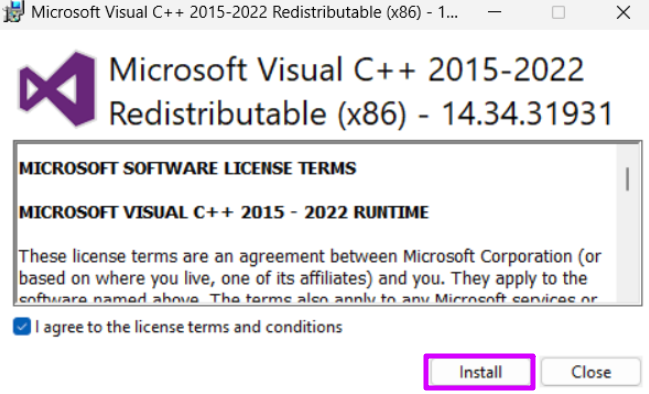

This is needed so that everything works, otherwise it will crash.
 
 

Time to install MySQL.
 
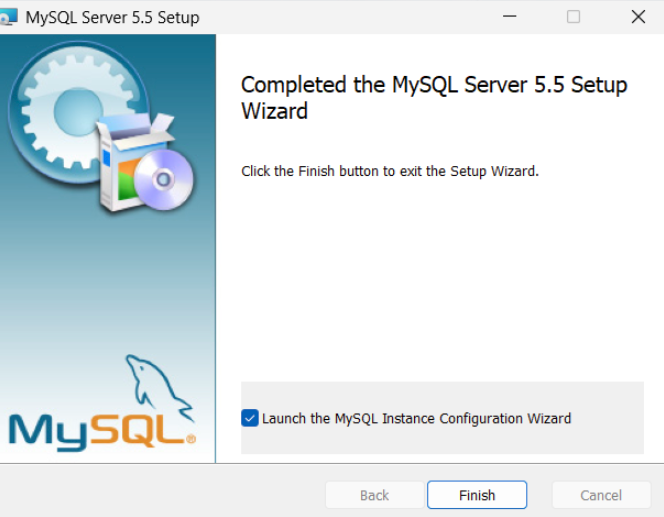
 
The SQL setup is pretty self explanatory. This will setup the database service, root password, and the port.
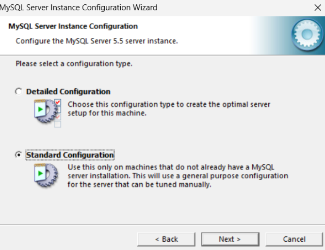

 
 

Now to register PHP from IIS. Run IISm as Administrator  
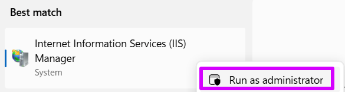

Find PHP Manager and click it.

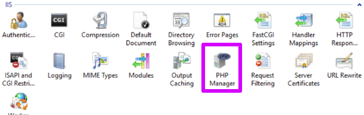

Register the new PHP version

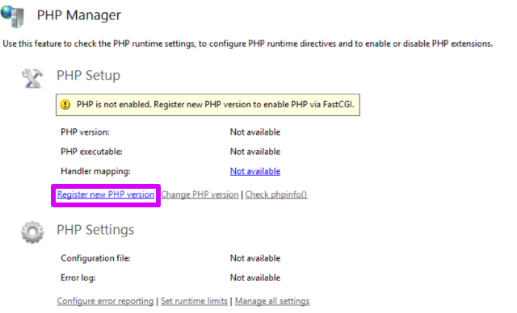

Select the php-cgi

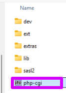

Now that this has put done I restarted IIS to apply the new PHP registration.

 
 

I then installed osTicket by extracting it into 'C:\inetpub\wwwroot'  

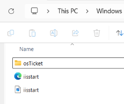

I also moved the upload folder which renamed it to 'C:\inetpub\wwwroot\osTicket'

I then restarted to apply everything.
 
 

I select the drop-down arrow then continue to the right side; where I click "Browse*:80 (http)" under Manage Folder.
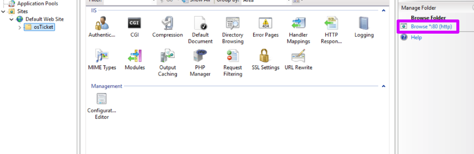
This leads me to 'http://localhost/osTicket (port 80)' which shows me that the site opens properly.
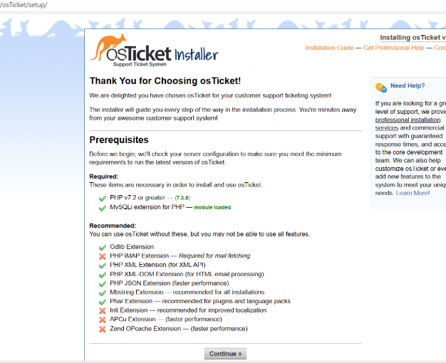
 
 

At the top of the site it shows that some extensions did not open properly so I went back to IIS to enable them.   
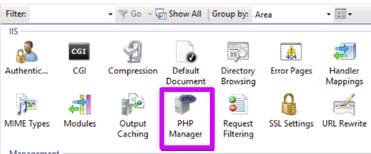
 
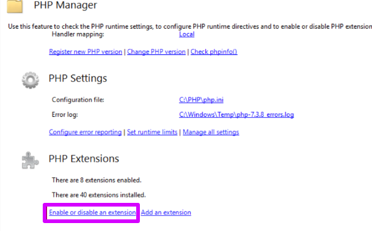
 
I then enable 'php_imap.dll'

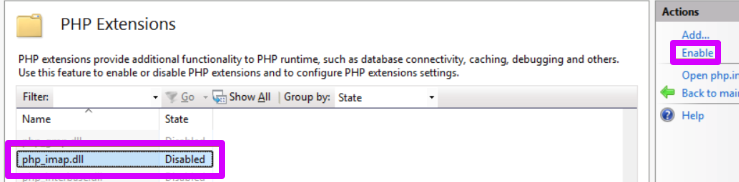
 
 
 

Now to solve the other problems. I renamed the 'ost-sampleconfig.php' to 'ost-config.php'   
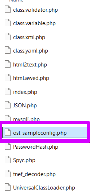
 

 
 

I then assigned permissions.  
 
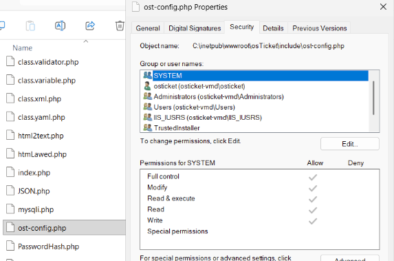

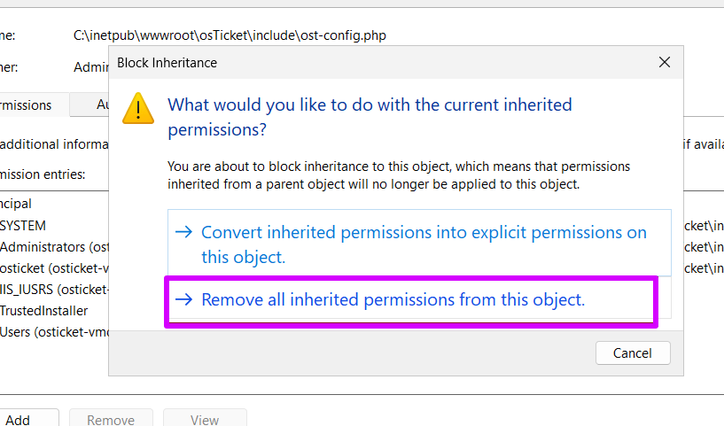

 Now I added permissions.
 
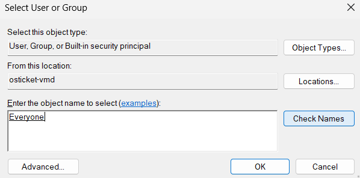

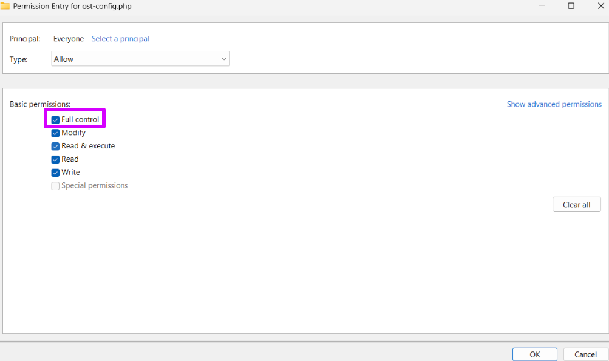

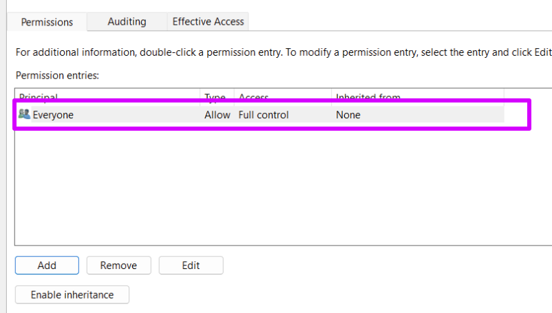

Now everyone has control for now just to test if everything functional. I will change that.
 
 

I am almost there with all these changes.  
 
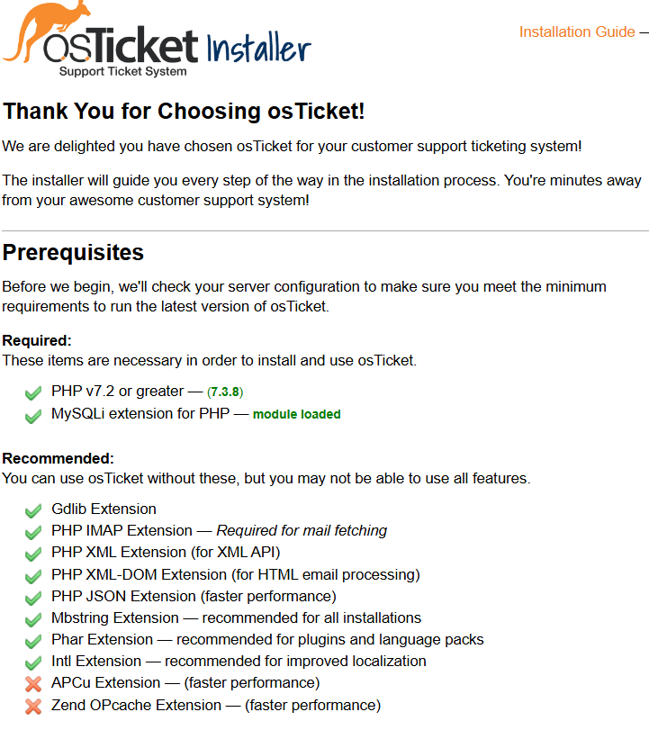
 
 

I now install HeidiSQL.  
 
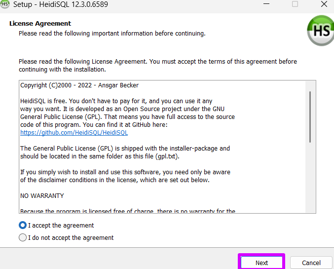

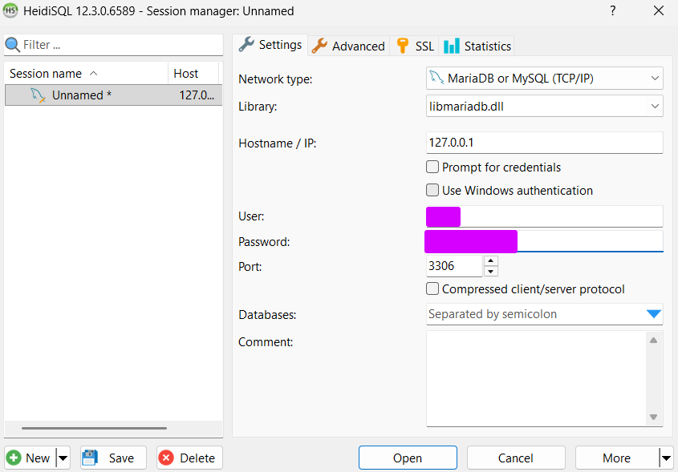

I now create a new database.

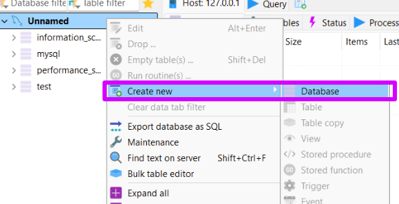

 I named the new database 'osTicket'
 
 
 

Now everything is finished with no errors!  
 
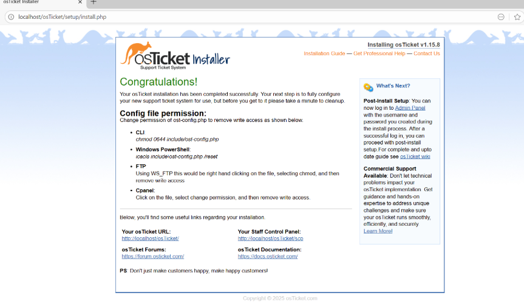
 
Now I will create fake requests and practice how to use ticketing software. This will mostly be for my home servers if it runs into any problems. 
 
 

