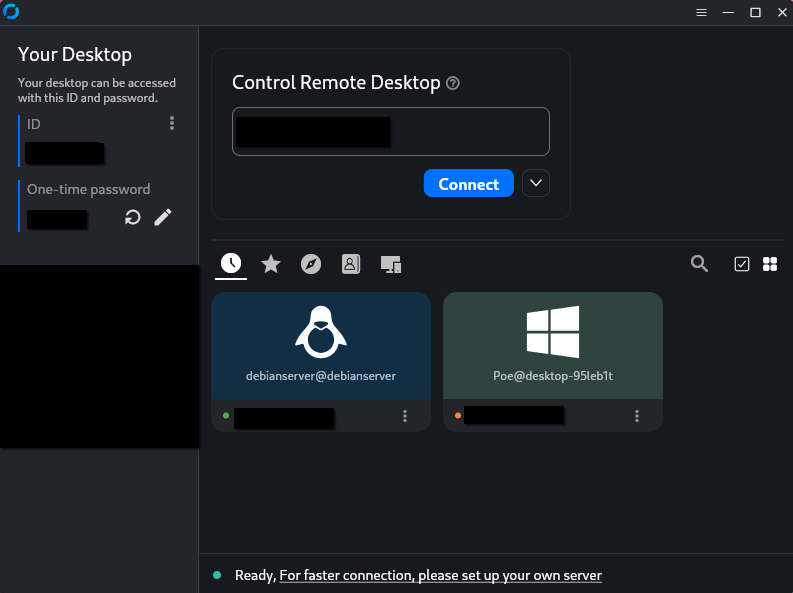

# osTicket-Homelab

<h2>Description</h2>
Fill in
 

<h2>Utilities Used</h2>

<b>osTicket</b>

<b>Oracle VirtualBox</b>

<b>Tailscale</b>

<b>Rustdesk</b>

<h2>Operating Systems Used </h2>

<b>Windows 10</b> 

<h2>Setup:</h2>

Used Rustdesk with Tailscale to securely remote into my home server:  

 
 
